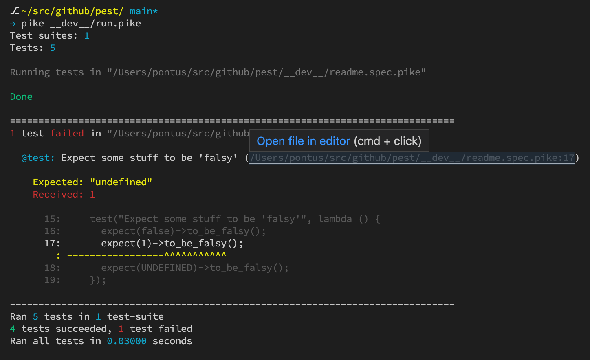

# Pest - A simple Pike unit test framework

This unit test framework is just in its infancy. Although it is, on its surface,
heaviliy inspired by [Jest](https://jestjs.io/), I have no intentions of making
a Jest implementation in Pike. Jest has more than 1,100 contributors and
probably a couple to 100,000 lines of code.

## Howto use

Clone this repository and symlink it into your `PIKE_MODULE_PATH` as
`Pest.pmod` (or point to it with the Pike `-M` argument).

Create a directory names `test` (or call it what ever you like). Create a
test-runner file in this directory (it can be called whatever), but for the
sake of this example lets call it `run-tests.pike`

```pike
# test/run-test.pike

import Pest;

int main() {
  run_tests(__DIR__);
}
```

Ok, so now lets add a test-suite file to the tests directory. By default
`run_tests()` will scan for files ending in `*.spec.pike`, but what file globs
to scan for can be given as second argument to `run_tests()`. So
`run_tests(dir, "*.test.pike")` is perfectly fine if one prefer to name the
files as such.

```pike
# test/readme.spec.pike

import Pest;

// A test suite file must have a main method
int main() {

  // ... that of the time of writing serves no great purpose
  describe("This is a namespace/block", lambda () {
    test("Expect some stuff to be 'truthy'", lambda () {
      expect(true)->to_be_truthy();
      expect(1)->to_be_truthy();
      expect("a")->to_be_truthy();
    });

    test("Expect some stuff to be 'falsy'", lambda () {
      expect(false)->to_be_falsy();
      expect(0)->to_be_falsy();
      expect(UNDEFINED)->to_be_falsy();
    });

    test("Expect some stuff to be the same (by reference)", lambda () {
      mapping a = ([]);
      mapping b = a;

      expect(a)->to_be(b);
    });

    test("Expect some stuff to be the same (by value)", lambda () {
      mapping a = ([ "index": 1, "value": "one" ]);
      mapping b = ([ "index": 1, "value": "one" ]);

      expect(a)->to_equal(b);
    });

    test("Expect some callback to have been called", lambda () {
      void call_it(function cb) {
        cb();
      };

      function my_callback = fn(lambda() {});
      call_it(my_callback);
      call_it(my_callback);

      expect(my_callback)->to_have_been_called();
      expect(my_callback)->to_have_been_called_n_times(2);
    });

  });
}
```

The result of running `test/run-test.pike` should give an output like:

```
$~: pike __dev__/run.pike
Test suites: 1
Tests: 5

Running tests in "/path/to/project/test/readme.spec.pike"

Done

------------------------------------------------------------------------------
Ran 5 tests in 1 test-suite
5 tests succeeded, 0 tests failed
Ran all tests in 0.02100 seconds
------------------------------------------------------------------------------
```

Now, lets imagine a test fails (I mean it's just theoretical thougt), then
the output would look something like:

```
Test suites: 1
Tests: 5

Running tests in "/path/to/project/test/readme.spec.pike"

Done

==============================================================================
1 test failed in "/path/to/project/test/readme.spec.pike"

  @test: Expect some stuff to be 'falsy' (/path/to/project/test/readme.spec.pike:17)

    Expected: "undefined"
    Received: 1

      15:     test("Expect some stuff to be 'falsy'", lambda () {
      16:       expect(false)->to_be_falsy();
      17:       expect(1)->to_be_falsy();
        : -----------------^^^^^^^^^^^
      18:       expect(UNDEFINED)->to_be_falsy();
      19:     });

------------------------------------------------------------------------------
Ran 5 tests in 1 test-suite
4 tests succeeded, 1 test failed
Ran all tests in 0.03000 seconds
------------------------------------------------------------------------------
```

**_Screenshot of output_**


## Limitations

- Atm all tests and test-suites are run synchronously.
- These are the implemented methods on `expect(expr)`
  - `->to_be_truthy()`: Checks that a value is "defined", which in Pike terms
    pretty much is anything not `0`.
  - `->to_be_falsy()`: The inverse of the above.
  - `->to_equal(x)`: Checks that the arguments equals eachother by value.
  - `->to_be(x)`: Checks that the arguments are the same by reference.
    For primitive types this is the same as `->to_equal()`.
  - `->to_have_been_called()`: Checks that a function has been called. The
    function given to `expect()` must be of type `Pest.Fn` (can be created
    via the "factory method" `Pest.fn(callback)`).
  - `->to_have_been_called_n_times(n)`: Same as above except it checks if the
    function was called exactly `n` times.
